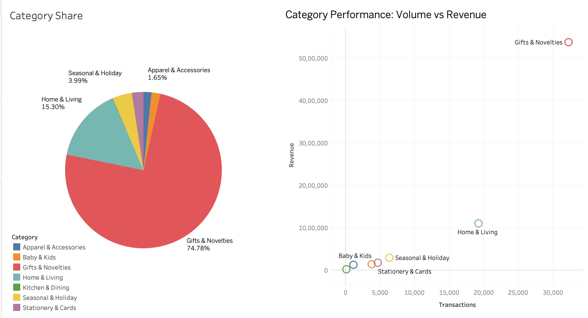
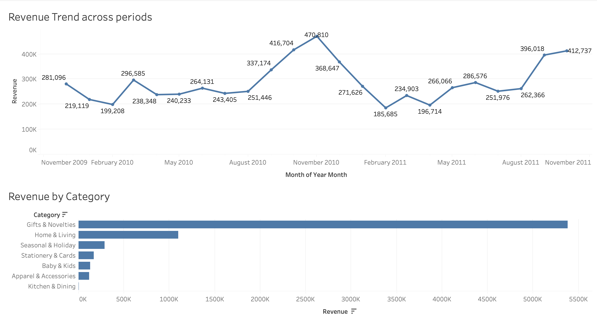

# retail-sales-analysis
Retail data analysis and demand forecasting project using Python (Machine Learning)

Goal of the project: 
- Understand how revenue varies over time and across categories  
- Identify areas where revenue could potentially be improved  
- Build a model to predict future demand using historical trends  

The workflow covers the full pipeline from data cleaning to modeling and business insights.

1. Started off with cleaning the data- Filtering out missing and invalid values, converting date features etc.
2. Exploratory Analysis: Peak sales period, revenue trends across periods (months).
3. Category Performance: Highlighting top performing segments.
4. Time Paterns: Sales vary by day and hour.
5. Geographic Revenue: UK seems to be dominating.
6. Revenue Oppurtunity Analysis: includes
   - Pricing Oppurtunity : products priced below category benchmarks and oppurtunity for better gains after price adjustments.
   - Basket Size Oppurtunity : customers with low average spend and what if the basket size increases? uplifts
   - Customer Retention : estimated recovery potential
7. Demand Forecasting : To predict sales, used Random Forest and Gradient Boosting with weekly units (per category) as the target
   - Gradient Boosting performs slightly better in capturing the demand trends.
8. Promotion Analysis : Compared promotional vs non-promotional transactions - used t-test for statistical performance, confidence intervals estimated along with the effect size (Cohen's d)
   - Promotion impacts revenues but effect varies (not a strong or consistent driver of revenue).

